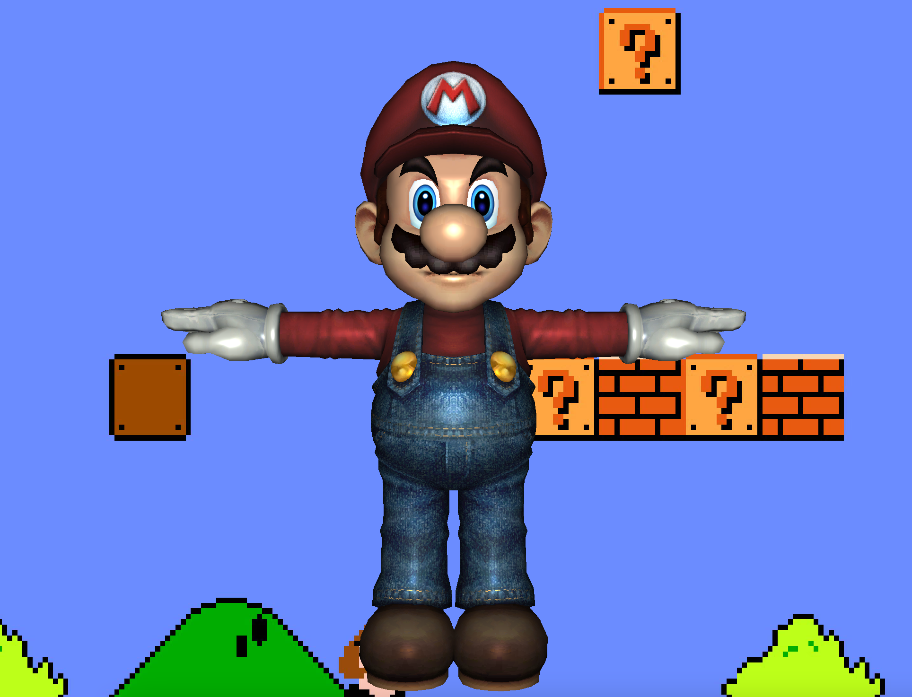
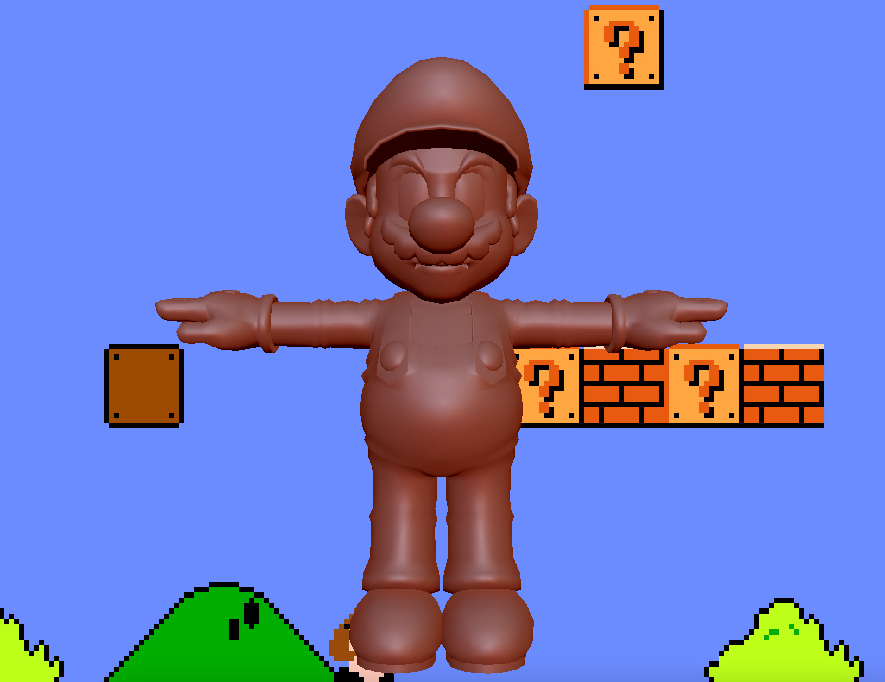
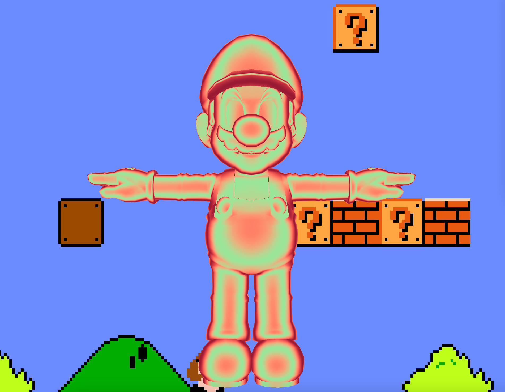
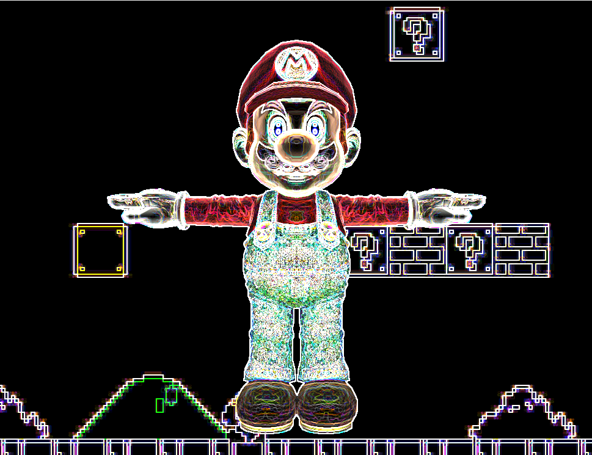
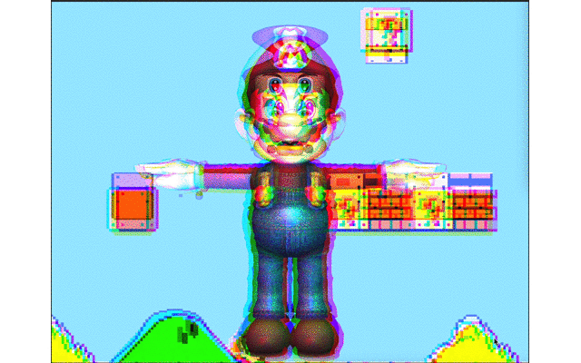

## Shading Mario
This project combines 4 options: surface shader, post-process shader, matcap options and model.  
### [Demo Vedio](https://www.youtube.com/watch?v=CzFy145YVHk&list=PLakW95iOzqX0AeSeOd3TueL--OoHxz7vm&index=1)
### Building Involves
OpenGL  
GLSL  
### Output Display
e.g.1 Bling-Phong

  

e.g.2 Redish Clay Texture

  

e.g.3 Color Gradient

  

e.g.4 Vertex Deformation

  

e.g.5 Sobel

  

e.g.6 Shake Shake

  

e.g.7 Worely Noise

  

